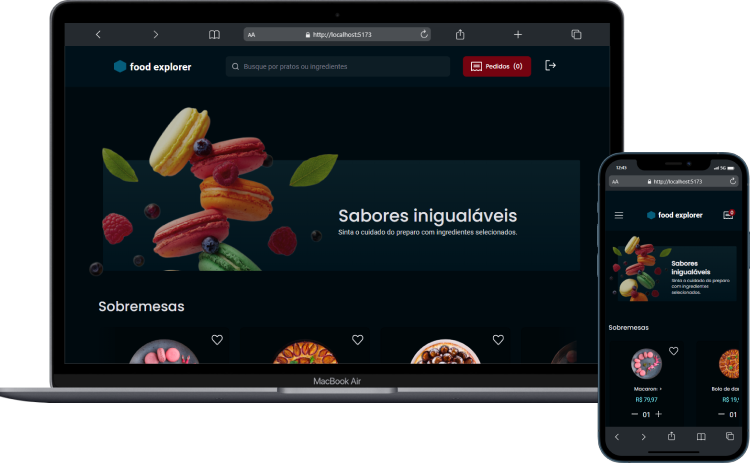

<h1 align="center">
  <a href="#-deploy" target="_blank">
    
  </a>
</h1>

<p align="center">
  <a href="#memo-licença">
    
  </a>
  
  <a href="https://app.netlify.com/sites/foodexplorer-dam450/deploys">
    
  </a>
  
  <a href="#-backend">
    
  </a> 
</p>


<p align="center">
Frontend do projeto Food Explorer</p>

<p align="center">
  <a href="#-deploy">Deploy</a>&nbsp;&nbsp;&nbsp;|&nbsp;&nbsp;&nbsp;
  <a href="#-backend">Backend</a>&nbsp;&nbsp;&nbsp;|&nbsp;&nbsp;&nbsp;
  <a href="#-tecnologias">Tecnologias</a>&nbsp;&nbsp;&nbsp;|&nbsp;&nbsp;&nbsp;
  <a href="#-projeto">Projeto</a>&nbsp;&nbsp;&nbsp;|&nbsp;&nbsp;&nbsp;
  <a href="#-layout">Layout</a>&nbsp;&nbsp;&nbsp;|&nbsp;&nbsp;&nbsp;
  <a href="#memo-licença">Licença</a>
</p>


<br>

<p align="center">
  <a href="https://foodexplorer-dam450.netlify.app/" target="_blank">
    
  </a>
</p>

## 🚀 Deploy

O projeto está hospedado na **Netlify** e pode ser acessado em:
- [FoodExplorer-dam450.netlify.app](https://foodexplorer-dam450.netlify.app/)

Para efetuar login na aplicação, utilize as credenciais abaixo:

**Administrador**:
  - login: `admin@email.com`
  - senha: `123456`

**Usuário**:
  - login: `user@email.com`
  - senha: `123456`

### 🏗️ Deploy local

1 - Para executar o projeto localmente é necessário que primeiro seja feito o deploy do backend da aplicação, acesse o repositório
[Github.com/dam450/foodexplorer-api](https://github.com/dam450/foodexplorer-api#%EF%B8%8F-deploy-local) e siga as instruções de deploy local.

2 - Faça o clone do projeto em uma pasta local através do prompt de terminal:
```bash
git clone https://github.com/dam450/foodexplorer.git
```
3 - Acesse a pasta e depois instale as dependencias do projeto:
```bash
cd foodexplorer
npm install
```
4 - Execute o servidor da aplicação:
```bash
npm run dev
```
5 - acesse o endereço de *localhost* que é mostrado no prompt, conforme o exemplo abaixo
```
  VITE v4.2.1  ready in 4478 ms

  ➜  Local:   http://localhost:5173/
```

## 🔙 Backend

O backend desta aplicação encontra-se no repositório: 
- [Github.com/dam450/foodexplorer-api](https://github.com/dam450/foodexplorer-api)

## 🦾 Tecnologias

Esse projeto foi desenvolvido com as seguintes tecnologias:

- [Axios](https://axios-http.com/)
- [Keen-Slider](https://keen-slider.io/)
- [React-currency-input-field](https://github.com/cchanxzy/react-currency-input-field)
- [React](https://react.dev/)
- [React-router](https://reactrouter.com/)
- [React-icons](https://react-icons.github.io/react-icons)
- [Styled-components](https://styled-components.com)
- [Vite.js](https://vitejs.dev)

## 💻 Projeto

O Food Explorer é um projeto criado como parte do desafio final do curso Explorer da [@Rockeseat](https://www.rocketseat.com.br/) para avaliar os conhecimentos adquiridos pelo aluno.

## 🔖 Layout

O layout Figma do projeto pode ser visualizado através do seguinte link:  
- [Figma.com/file/YkAg3miDsja6W4qTzIMdbB/food-explorer-v2](https://www.figma.com/file/YkAg3miDsja6W4qTzIMdbB/food-explorer-v2-(rocketseat)?node-id=0%3A1&viewer=1).

## :memo: Licença

Esse projeto está sob a licença MIT.

---

> Criado por [**Dam450**](https://github.com/dam450/).
